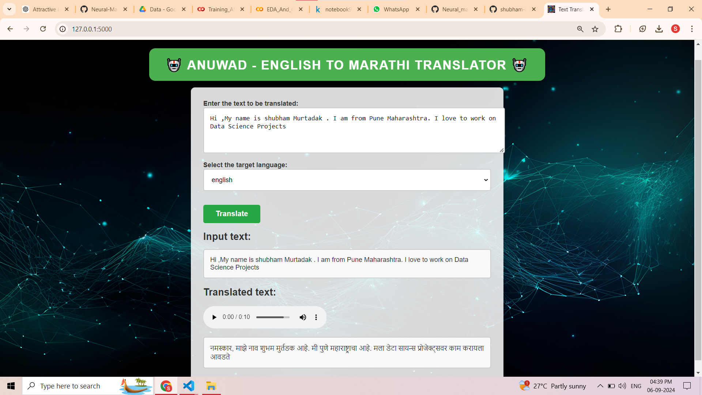

# 🤖 Anuwad - English to Marathi Translator 🤖

## Neural Machine Translation with TensorFlow 🌐💬

This repository contains a TensorFlow implementation of an Attention-based Neural Machine Translation (NMT) model named **Anuwad**. The model leverages the Bahdanau Attention mechanism to translate sentences from English to Marathi using a deep learning architecture. 🚀

## Implementation Architecture 🏗️

### The Bahdanau Architecture

The architecture consists of the following components:

1. **The Encoder**: Processes the input sequence and produces a context-rich representation of the source sentence. 📖
2. **The Decoder**: Generates the target sequence based on the context provided by the encoder and the previously generated tokens. 🛠️
3. **The Bahdanau Attention Algorithm**: Allows the decoder to focus on different parts of the input sequence at each step of generation, improving translation quality. 🌟

### Flask UI 🖥️💻

A user-friendly Flask-based UI allows you to run the model locally. Input English sentences and get Marathi translations with ease.

## Results 🎯

Here are some sample translations produced by the model:

| Input Sequence (English)                               | Output Sequence (Marathi)                                |
|--------------------------------------------------------|----------------------------------------------------------|
| i like french                                          | मला फ्रेंच आवडते                                         |
| your cell phones not working                          | तुमचा सेलफोन चालत नाहीये                                |
| whats your favorite website                           | तुमचं आवडतं संकेतस्थळ कोणतं आहे                        |
| spanish is widely spoken in south america              | दक्षिण अमेरिकेत अमेरिकेत बोलली जाते                    |
| if hed known the truth hed have told me               | त्याला सत्य माहीत असतं तर त्याने मला सांगितलं असतं        |

## License 📜

This project is licensed under the MIT License - see the [LICENSE](LICENSE) file for details.
